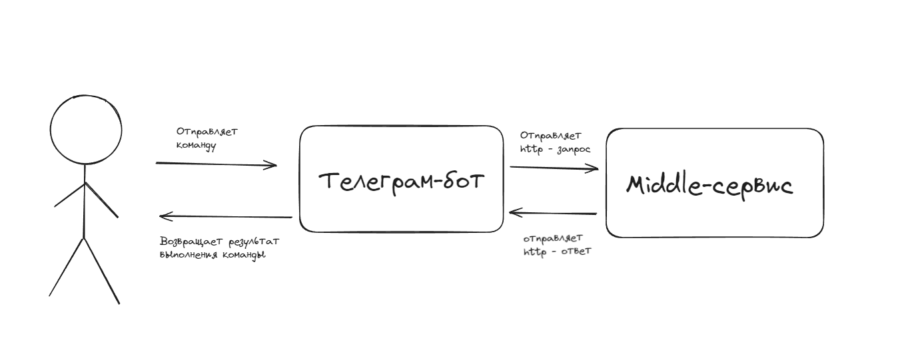
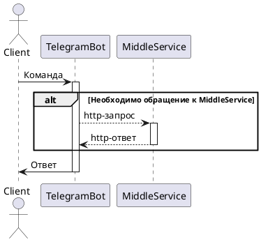

# Телеграм бот приложения "Мини-банк"
Данный сервис представляет собой frontend - часть приложения "Мини-банк"

## Что делает

## TO BE

## Участники
В случае вопросов обращатся [Морковникову Виктору](https://github.com/RojoBlanco).